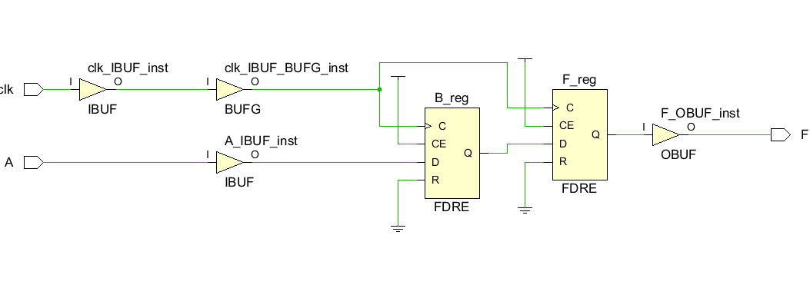
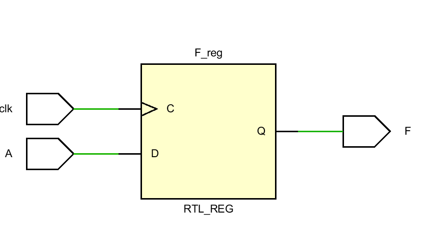

# 实验二报告
## 个人信息
- 姓名：欧阳天麟
- 学号:2023311412
- 班级： 计算机与电子通信4班
- 学期： 2024-2025秋季学期
- 实验项目： 实验二
- 上课地点： T2615
- 实验完成时间:10/17 21:40 ,耗时5h左右

## 实验结果

1.流水灯仿真波形分析

2.rtl分析图

3.计数器最大值计算

系统时钟为 100 MHz（即每秒 100,000,000 个周期），那么每个周期的时间为：

\[
\text{每个周期的时间} = \frac{1}{100,000,000} \text{秒} = 10 \text{纳秒}
\]

1. **频率 100Hz（0.01s）**：
   - 时间间隔 = 0.01s
   - 计数器最大值计算：
   \[
   \text{计数器最大值} = \frac{\text{时钟频率} \times \text{时间间隔}}{1} = 100,000,000 \times 0.01 = 1,000,000 - 1
   \]

2. **频率 10Hz（0.1s）**：
   - 时间间隔 = 0.1s
   - 计数器最大值计算：
   \[
   \text{计数器最大值} = 100,000,000 \times 0.1 = 10,000,000 - 1
   \]

3. **频率 4Hz（0.25s）**：
   - 时间间隔 = 0.25s
   - 计数器最大值计算：
   \[
   \text{计数器最大值} = 100,000,000 \times 0.25 = 25,000,000 - 1
   \]

4. **频率 2Hz（0.5s）**：
   - 时间间隔 = 0.5s
   - 计数器最大值计算：
   \[
   \text{计数器最大值} = 100,000,000 \times 0.5 = 50,000,000 - 1
   \]

### 结果总结

根据上述计算，最终的计数器最大值如下：
- **100Hz（0.01s）**: 1,000,000 - 1
- **10Hz（0.1s）**: 10,000,000 - 1
- **4Hz（0.25s）**: 25,000,000 - 1
- **2Hz（0.5s）**: 50,000,000 - 1

## 课后作业

### 习题一：

- 非阻塞赋值：
在第一个时钟上升沿时，cnt 当前的值是初始值 4'h0（即 0）。

第一条赋值语句执行：cnt <= 5，表示 cnt 将在下一个时钟周期被更新为 5。

第二条赋值语句执行：cnt <= cnt + 1'b1，但由于 cnt 的当前值仍是 0，所以这条语句实际上是 cnt <= 0 + 1，即 cnt 将被更新为 1。

由于这些都是非阻塞赋值，更新会在下一个时钟周期才生效。因此，在第一个周期结束时，cnt 的值还是 0。

第二个周期：

在第二个时钟上升沿时，cnt 会同时接收上一个周期的两次赋值操作。

由于最后一次赋值 cnt <= cnt + 1'b1 会覆盖前面的赋值 cnt <= 5，因此 cnt 会被更新为 1。同里在下个周期cnt变为2.

- 阻塞赋值

阻塞赋值是代码会以顺序的方式执行赋值操作，这意味着在同一个时钟周期内的后续赋值会立即生效并覆盖之前的赋值。

则clk变化是cnt按代码顺序变成6，此后保持为6不变

### 习题二：

- 非阻塞赋值：

非阻塞赋值，更新会在下一个时钟周期才生效。则B在下一个周期会由不确定的值更新，但F的值仍然不确定，到下下个周期才会有有意义的值

- 阻塞赋值：

阻塞赋值，更新会在同一个时钟周期内生效。则B在同一个周期内会由不确定的值更新，F的值始终与B相同

注意到电路中只有“F",F与B完全相同

### 图形区别总结：

如果always块的信号之间没有关联，阻塞和非阻塞赋值生成的电路是一样的。但如果信号之间有关联，则生成的电路区别很大。

阻塞赋值，上一行的数据变化可以立即传递给下一行，前面的执行完，数据更新后，才执行后面的，后面的语句被阻塞。

非阻塞，前面语句的执行并不会阻塞后面的语句，数据是不会立即传递到后面被赋值的信号，语句并行执行，同时赋值。