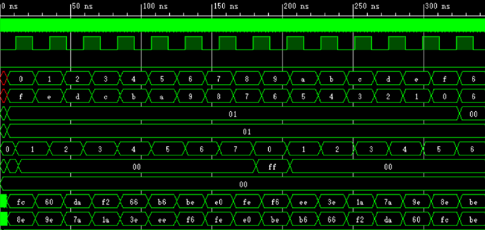
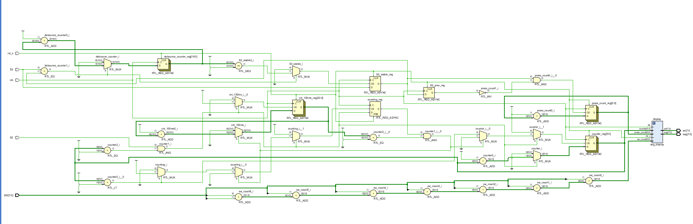

# 实验三报告
## 个人信息
- 姓名：欧阳天麟
- 学号:2023311412
- 班级： 计算机与电子通信4班
- 学期： 2024-2025秋季学期
- 实验项目： 实验三
- 上课地点： T2615
- 实验完成时间:10/24 11:47 ,耗时5h左右,其中找出数组开小了的错误时间较长且不太应该……

## 实验结果

仿真波形分析：

初始时，使能输入端 en=8’b0000_0000，此时使能输出端 len=8‘b0000_0000。scancnt 为初始值 3’b000，seg0=8’d0，seg1=8’d0。

5ns 时，令使能输入端为 en=8’b0000_0001 并保持至 325ns，可见：5ns 时，由于 scancnt=3’b000，使能输出端改变，len=8’b0000_0001 并保持至 325ns，此时 seg0=8’hff；scancnt 在下一个分频时钟上升沿之前保持 3’b000。

在 下 一 个 分 频 时 钟 上 升 沿 时 ， scancnt=3’d1 ， 此 后 的 第 一 个 时 钟 上 升 沿 (clk) ，
seg0=8’b0000_0000。

在之后每个分频时钟上升沿，scancnt 计数依次加一，当计数至 3’d7 时，下一个分频时钟上升沿时 scancnt=3’d0，此后的第一个时钟上升沿(clk)，seg0=8’hff 并保持一个分频时钟周期。

之后 scancnt 在每个分频时钟上升沿计数依次加一，seg0 保持 8’d0 不变。

在 325ns~345ns，令 en=8’b0000_0000，由于 scancnt=3’d6，故 len 保持 8’b0000_0001 不
变。

由于 en=8’b0000_0001 和 en=8’b0000_0000 时均不改变 seg1 的值，故 seg1=8’b0000_0000
保持不变。

对于拨码输入 hex0、hex1 和各 led 输出：0~5ns，hex0、hex1 未被赋值，为高阻态。在第一个时钟上升沿到 5ns，各 led 由译码模
块赋默认值 8’b0000_0000。

5ns~325ns，每延迟 20ns，使 hex0 的值从 4’h0 依次增加到 4’hf，hex1 的值从 4’hf 依次减小到 4’h0；led_l 和 led_h 对应输出。

325~345ns，令 hex0=8'h6;hex1=8'h6，led_l 和 led_h 对应输出。

在 0~345ns 间，由于计数器未计满 500 个分频时钟周期，high 和 low 保持 4’d1 和 4’d0不变，故 5ns~345ns，cntled_h 和 cntled_l 对应输出 h’60 和 h’fc。

rtl分析截图：

数码管字符编码表：

segment_data[0] = 8'h03; // 0
segment_data[1] = 8'h9F; // 1
segment_data[2] = 8'b00100101; // 2
segment_data[3] = 8'b00001101; // 3
segment_data[4] = 8'b10011001; // 4
segment_data[5] = 8'b01001001; // 5
segment_data[6] = 8'b01000001; // 6
segment_data[7] = 8'b00011111; // 7
segment_data[8] = 8'b00000001; // 8
segment_data[9] = 8'b00011001; // 9
A:00010001
b:11000001
c:11100101
d:10000101
E:01100001
F:01110001